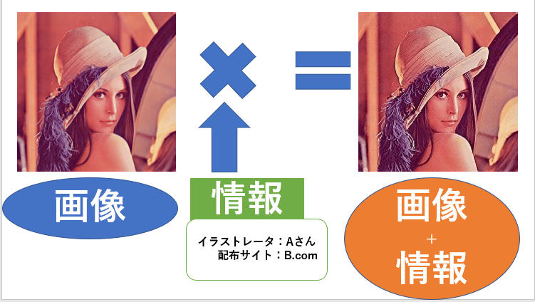
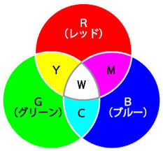
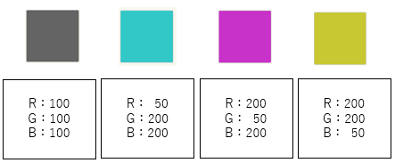
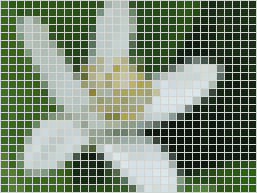
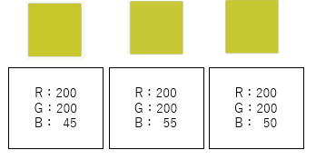

# データハイディングって何？
　情報を気づかれないように動画や音楽に埋め込む技術

### イメージ図

このように画像に作者や販売元などの情報を隠す技術をデータハイディングと呼びます。

情報が埋め込まれている事実そのものが分からないので，もともとのイラストに違和感がないのが特徴です。

## 情報の隠し方

一般的に画像はRGBと言って，赤緑青の３色で色が表現されています。

RGBのR(赤)を強くしたり，G(緑)B(青)を弱くしたりして様々な色を表現できます。

こんな感じの色でさまざまな色を表現できます。
このたくさんの色を集めてタイル状に並べて画像データが作られています。

こんな感じで画像データが作られています。
ものすごく細かいドット絵を作っているイメージですね。

この１マスをピクセルと表現したりするのですが，一部のピクセルのRGBを少しだけ変更しても元の画像と違和感がありません。

たとえば，B(青)の値を45,55,50と変化させてもあまり違いがありません。

文字もコンピュータ上では数字であらわされるので，こんな風に値を少しだけ変えて後でその変化させている数値を読み取ることで，情報を抜き出すことができます。

## データハイディングの流れ
### 埋め込み
１．埋め込みたい情報を数値に変更する

２．数値にしたデータを元の情報に埋め込める形のデータに変更する。

３．埋め込み先の画像などに２で作った情報を足し合わせる。

### 抜き取り(抽出)
１．埋め込まれたデータから埋め込まれているデータの部分を抜き出す。

２．抜き出したデータを埋め込みに利用される前の状態に戻す。

このような流れでデータハイディングは行われています。